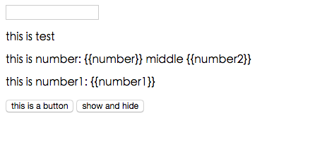
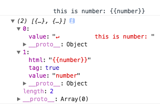
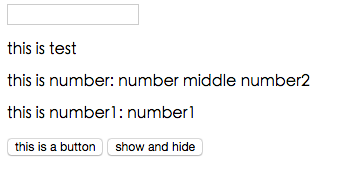

# vue-imitate

> 深入解析vue 1实现原理，并实现vue双向数据绑定模型


下面我们重头开始框架的实现，我们知道，vue的使用方式如下：

```js

var vm = new Vue({
	el: 'root',
	data() {
		return {
			message: 'this is test',
			number: 5,
			number1: 1,
			number2: 2,
			showNode: false
		}
	},
	methods: {
		add() {
			this.number1 += 1;
			this.number += 1;
		},
		show() {
			this.showNode = !this.showNode;
		}
	}
})

```

由此可见，vue为一个构造函数，并且调用时传入一个对象参数，所以主函数可以如下，源码可见[这里](https://github.com/pf12345/vue-imitate/blob/master/src/init.js)；并对参数进行对应的初始化处理：

```
// init.js 
export default function vueImitate(options) {
	this.options = options || {}; 
	this.selector = options.el ? ('#' + options.el) : 'body'; // 根节点selector
	this.data = typeof options.data === 'function' ? options.data() : options.data; // 保存传入的data
	this.el = document.querySelectorAll(this.selector)[0]; // 保存根节点

	this._directives = [];
}

```

此时可以使用`new vueImitate(options)`的方式进行调用，首先，我们需要界面上展示正确的数据，也就是将下面页面进行处理，使其可以正常访问；



我们可以参考vue的实现方式，vue将``{{ }}``这种绑定数据的方式转化为指令(directive)，即``v-text``类似；而``v-text``又是如何进行数据绑定的呢？通过下面代码可知，是通过对文本节点重新赋值方式实现，源码见[这里](https://github.com/pf12345/vue-imitate/blob/master/src/directives/text.js)：

```
export default {
  bind () {
    this.attr = this.el.nodeType === 3
      ? 'data'
      : 'textContent'
  },
  update (value) {
    this.el[this.attr] = value
  }
}
```

那么，问题来了，如果需要按照上面的方式实现数据的绑定，我们需要将现在的字符串``{{number}}``转化为一个文本节点，并对它进行指令化处理；这些其实也就是vue compile(编译)、link过程完成的，下面我们就先实现上面功能需求；

## compile

整个编译过程肯定从根元素开始，逐步向子节点延伸处理；

```
export default function Compile(vueImitate) {
	vueImitate.prototype.compile = function() {
		let nodeLink = compileNode(this.el),
			nodeListLink = compileNodeList(this.el.childNodes, this),
			_dirLength = this._directives.length;

		nodeLink && nodeLink(this);
		nodeListLink && nodeListLink(this);

		let newDirectives = this._directives.slice(_dirLength);

		for(let i = 0, _i = newDirectives.length; i < _i; i++) {
			newDirectives[i]._bind();
		}
	}
}

function compileNode(el) {
	let textLink, elementLink;
	// 编译文本节点
	if(el.nodeType === 3 && el.data.trim()) {
		textLink = compileTextNode(el);
	} else if(el.nodeType === 1) {
		elementLink = compileElementNode(el);
	}
	return function(vm) {
		textLink && textLink(vm);
		elementLink && elementLink(vm);
	}
}

function compileNodeList(nodeList, vm) {
	let nodeLinks = [], nodeListLinks = [];
	if(!nodeList || !nodeList.length) {
		return;
	}
	for(let i = 0, _i = nodeList.length; i < _i; i++) {
		let node = nodeList[i];
		nodeLinks.push(compileNode(node)),
		nodeListLinks.push(compileNodeList(node.childNodes, vm));
	}
	return function(vm) {
		if(nodeLinks && nodeLinks.length) {
			for(let i = 0, _i = nodeLinks.length; i < _i; i++) {
				nodeLinks[i] && nodeLinks[i](vm);
			}
		}
		if(nodeListLinks && nodeListLinks.length) {
			for(let i = 0, _i = nodeListLinks.length; i < _i; i++) {
				nodeListLinks[i] && nodeListLinks[i](vm);
			}
		}
	}
}
```

如上代码，首先，我们通过定义一个``Compile``函数，将编译方法放到构造函数``vueImitate.prototype``，而方法中，首先主要使用``compileNode``编译根元素，然后使用``compileNodeList(this.el.childNodes, this)``编译根元素下面的子节点；而在``compileNodeList``中，通过对子节点进行循环，继续编译对应节点及其子节点，如下代码：

```
//  function compileNodeList
for(let i = 0, _i = nodeList.length; i < _i; i++) {
	let node = nodeList[i];
	nodeLinks.push(compileNode(node)),
	nodeListLinks.push(compileNodeList(node.childNodes, vm));
}

```

然后进行递归调用，直到最下层节点：而在对节点进行处理时，主要分为文本节点和元素节点；文本节点主要处理上面说的``{{number}}``的编译，元素节点主要处理节点属性如``v-model``、``v-text``、``v-show``、``v-bind:click``等处理；

```js
function compileTextNode(el) {
	let tokens = parseText(el.wholeText);
	var frag = document.createDocumentFragment();
	for(let i = 0, _i = tokens.length; i < _i; i++) {
		let token = tokens[i], el = document.createTextNode(token.value)
		frag.appendChild(el);
	}

	return function(vm) {
		var fragClone = frag.cloneNode(true);
		var childNodes = Array.prototype.slice.call(fragClone.childNodes), token;
		for(let j = 0, _j = tokens.length; j < _j; j++) {
			if((token = tokens[j]) && token.tag) {
				let	_el = childNodes[j], description = {
					el: _el,
					token: tokens[j],
					def: publicDirectives['text']
				}
				vm._directives.push(new Directive(vm, _el, description))
			}
		}

		// 通过这儿将`THIS IS TEST {{ number }} test` 这种转化为三个textNode
		if(tokens.length) {
			replace(el, fragClone);
		}
	}	
}

function compileElementNode(el) {
	let attrs = getAttrs(el);
	return function(vm) {
		if(attrs && attrs.length) {
			attrs.forEach((attr) => {
				let name = attr.name, description, matched;
				if(bindRE.test(attr.name)) {
					description = {
						el: el,
						def: publicDirectives['bind'],
						name: name.replace(bindRE, ''),
						value: attr.value
					}
				} else if((matched = name.match(dirAttrRE))) {
					description = {
						el: el,
						def: publicDirectives[matched[1]],
						name: matched[1],
						value: attr.value
					}
				}
				if(description) {
					vm._directives.push(new Directive(vm, el, description));

				}
			})
		}
	}
}

```

这里，先主要说明对文本节点的处理，我们上面说过，我们需要对``{{number}}``之类进行处理，我们首先必须将其字符串转化为文本节点，如``this is number1: {{number1}}``这种，我们必须转换为两个文本节点，一个是``this is number1: ``，它不需要进行任何处理；另一个是``{{number1}}``，它需要进行数据绑定，并实现双向绑定；因为只有转化为文本节点，才能使用``v-text``类似功能实现数据的绑定；而如何进行将字符串文本分割为不同的文本节点呢，那么，就只能使用正则方式``let reg = /\{\{(.+?)\}\}/ig;``将``{{ number }}``这种形式数据与普通正常文本分割之后，再分别创建``textNode``，如下：

```
function parseText(str) {
	let reg = /\{\{(.+?)\}\}/ig;
	let matchs = str.match(reg), match, tokens = [], index, lastIndex = 0;

	while (match = reg.exec(str)) {
		index = match.index
	    if (index > lastIndex) {
	      tokens.push({
	        value: str.slice(lastIndex, index)
	      })
	    }
		tokens.push({
			value: match[1],
			html: match[0],
			tag: true
		})
	    lastIndex = index + match[0].length
	}

	return tokens;
}
```

通过上面``parseText``方法，可以将``this is number: {{number}}``转化为如下结果：



转化为上图结果后，就对返回数组进行循环，分别通过创建文本节点;这儿为了性能优化，先创建文档碎片，将节点放入文档碎片中；

```
// function compileTextNode
// el.wholeText => 'this is number: {{number}}'

let tokens = parseText(el.wholeText);
var frag = document.createDocumentFragment();
for(let i = 0, _i = tokens.length; i < _i; i++) {
	let token = tokens[i], el = document.createTextNode(token.value)
	frag.appendChild(el);
}

```

而在最后编译完成，执行``linker``时，主要做两件事，第一是对需要双向绑定的节点创建``directive``，第二是将整个文本节点进行替换；怎么替换呢？如最开始是一个文本节点``this is number: {{number}}``，经过上面处理之后，在``frag``中其实是两个文本节点``this is number: ``和``{{number}}``；此时就使用``replaceChild``方法使用新的节点替换原始的节点；

```
// compile.js
function compileTextNode(el) {
	let tokens = parseText(el.wholeText);
	var frag = document.createDocumentFragment();
	for(let i = 0, _i = tokens.length; i < _i; i++) {
		let token = tokens[i], el = document.createTextNode(token.value)
		frag.appendChild(el);
	}

	return function(vm) {
		var fragClone = frag.cloneNode(true);
		var childNodes = Array.prototype.slice.call(fragClone.childNodes), token;
		
		// 创建directive
		......

		// 通过这儿将`THIS IS TEST {{ number }} test` 这种转化为三个textNode
		if(tokens.length) {
			replace(el, fragClone);
		}
	}	
}

// util.js
export function replace (target, el) {
  var parent = target.parentNode
  if (parent) {
    parent.replaceChild(el, target)
  }
}
```

替换后结果如下图：



经过与最开始图比较可以发现，已经将``this is number: {{number}} middle {{number2}}``转化为``this is number: number middle number2``；只是此时，仍然展示的是变量名称，如``number``,``number2``；那么，我们下面应该做的肯定就是需要根据我们初始化时传入的变量的值，将其进行正确的展示；最终结果肯定应该为``this is number: 5 middle 2``；即将``number``替换为``5``、将``number2``替换为``2``;那么，如何实现上述功能呢，我们上面提过，使用指令(directive)的方式；下面，就开始进行指令的处理；

## Directive(指令)

对于每一个指令，肯定是隔离开的，互相不受影响且有自己的一套处理方式；所以，我们就使用对象的方式；一个指令就是一个实例化的对象，彼此之间互不影响；如下代码：

```
export default function Directive(vm, el, description) {
	this.vm = vm;
	this.el = el;
	this.description = description;
	this.expression = description ? description.value : '';
}
```
在创建一个指令时，需要传入三个参数，一个是最开始初始化``var vm = new vueImitate(options)``时实例化的对象；而el是需要初始化指令的当前元素，如``<p v-show="showNode">this is test</p>``，需要创建``v-show``的指令，此时的``el``就是当前的``p``标签；而``description``主要包含指令的描述信息；主要包含如下：
```
// 源码见 './directives/text.js'
var text = {
  bind () {
    this.attr = this.el.nodeType === 3
      ? 'data'
      : 'textContent'
  },
  update (value) {
    this.el[this.attr] = value
  }
}

// 如，'{{number}}'
description = {
	el: el, // 需要创建指令的元素
	def: text, // 对指令的操作方法，包括数据绑定(bind)、数据更新(update)，见上面 text
	name: 'text', // 指令名称
	value: 'number' // 指令对应数据的key
}
```

通过```new Directive(vm, el, description)```就创建了一个指令，并初始化一些数据；下面就先通过指令对界面进行数据渲染；所有逻辑就放到了``_bind``方法中，如下：

```
// directive.js
Directive.prototype._bind = function() {
	extend(this, this.description.def);
	if(this.bind) {
		this.bind();
	}

	var self = this, watcher = new Watcher(this.vm, this.expression, function() {
		self.update(watcher.value);
	})

	if(this.update) {
		this.update(watcher.value);
	}
}

// util.js
export function extend(to, from) {
	Object.keys(from).forEach((key) => {
		to[key] = from[key];
	})
	return to;
}
```
方法首先将传入的指令操作方法合并到``this``上，方便调用，主要包括上面说的``bind``、``update``等方法；其主要根据指令不同，功能不同而不同定义；所有对应均在``./directives/*``文件夹下面，包括文本渲染text.js、事件添加bind.js、v-model对应model.js、v-show对应show.js等；通过合并以后，就执行``this.bind()``方法进行数据初始化绑定；但是，目前为止，当去看界面时，仍然没有将``number``转化为``5``；为什么呢？通过查看代码：
```
export default {
  bind () {
    this.attr = this.el.nodeType === 3
      ? 'data'
      : 'textContent'
  },

  update (value) {
    this.el[this.attr] = value
  }
}
```
``bind``并没有改变节点展示值，而是通过``update``; 所以，如果调用``this.update(123)``，可发现有如下结果：


其实我们并不是直接固定数值，而是根据初始化时传入的值动态渲染；但是目前为止，至少已经完成了界面数据的渲染，只是数据不对而已；
然后，我们回头看下编译过程，我们需要在编译过程去实例化指令(directive)，并调用其``_bind``方法，对指令进行初始化处理；

```
// 见compile.js 'function compileTextNode'
let	_el = childNodes[j], description = {
	el: _el,
	name: 'text',
	value: tokens[j].value,
	def: publicDirectives['text']
}
vm._directives.push(new Directive(vm, _el, description));

// 见compile.js 'function compile'
let newDirectives = this._directives.slice(_dirLength);
for(let i = 0, _i = newDirectives.length; i < _i; i++) {
	newDirectives[i]._bind();
}

```

上面说了，目前还没有根据传入的数据进行绑定，下面，就来对数据进行处理；

## 数据处理

数据处理包括以下几个方面：

 - 数据双向绑定
 - 数据变化后，需要通知到ui界面，并自动变化
 - 对于输入框，使用v-model时，需要将输入内容反应到对应数据

## Demo运行

``` bash
# install dependencies
npm install

# serve with hot reload at localhost:8080
npm run dev

```
